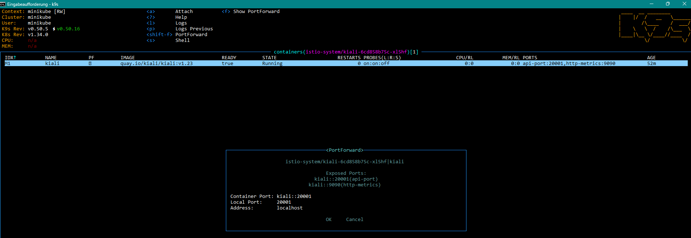
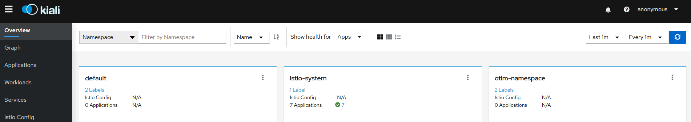

# Getting Started

### Reference Documentation
For further reference, please consider the following sections:

* [Official Gradle documentation](https://docs.gradle.org)
* [Spring Boot Gradle Plugin Reference Guide](https://docs.spring.io/spring-boot/4.0.0-SNAPSHOT/gradle-plugin)
* [Create an OCI image](https://docs.spring.io/spring-boot/4.0.0-SNAPSHOT/gradle-plugin/packaging-oci-image.html)
* [Spring Web](https://docs.spring.io/spring-boot/4.0.0-SNAPSHOT/reference/web/servlet.html)
* [Spring Boot Actuator](https://docs.spring.io/spring-boot/4.0.0-SNAPSHOT/reference/actuator/index.html)
* [OpenTelemetry](https://docs.spring.io/spring-boot/4.0.0-SNAPSHOT/reference/actuator/observability.html#actuator.observability.opentelemetry)

### Guides
The following guides illustrate how to use some features concretely:

* [Building a RESTful Web Service](https://spring.io/guides/gs/rest-service/)
* [Serving Web Content with Spring MVC](https://spring.io/guides/gs/serving-web-content/)
* [Building REST services with Spring](https://spring.io/guides/tutorials/rest/)
* [Building a RESTful Web Service with Spring Boot Actuator](https://spring.io/guides/gs/actuator-service/)

### Additional Links
These additional references should also help you:

* [Gradle Build Scans – insights for your project's build](https://scans.gradle.com#gradle)


# Local Setup
```sh
docker build -t otlm-app:latest .
docker run -p 8080:8080 --name otlm-app otlm-app:latest
```

## docker-compose Setup (with OpenTelemetry Collector)
```sh
./gradlew clean build
docker compose up -d --build
```
Services:
- otel-collector: OTLP gRPC :4317, OTLP HTTP :4318, Health :13133, Prometheus :9464
- otlm-app: Spring Boot app :8080

Access:
- App: http://localhost:8080
- App health: http://localhost:8080/actuator/health
- Collector health: http://localhost:13133/health
- Collector Prometheus: http://localhost:9464/metrics

Environment variables (compose):
- MANAGEMENT_OTLP_METRICS_EXPORT_URL=http://otel-collector:4318/v1/metrics
- MANAGEMENT_TRACING_EXPORT_OTLP_ENDPOINT=http://otel-collector:4317
- MANAGEMENT_OTLP_LOGS_EXPORT_URL=http://otel-collector:4318/v1/logs
- OTEL_RESOURCE_ATTRIBUTES=service.name=otlm-app,service.namespace=testApp,service.version=0.0.1-SNAPSHOT

## Troubleshooting Metrics Export
Error: `Failed to publish metrics to OTLP receiver (context: url=http://localhost:4318/v1/metrics)`
Checklist:
1. In compose use hostname `otel-collector` not `localhost`.
2. Collector healthy? `docker compose ps`.
3. Logs: `docker compose logs otel-collector | findstr /i error`.
4. Connectivity: `docker compose exec otlm-app curl -f http://otel-collector:4318/v1/metrics || echo failed`.
5. Ports free / firewall not blocking (4317, 4318, 9464, 13133).

## Tear Down
```sh
docker compose down -v
```


## Istio Setup
```sh
minikube start --memory=4096
```

Apply the Istio configuration:
```sh
kubectl apply -f /minikube/.
```

This will start the Istio components in your Minikube cluster.
It will also create a namespace with name otlm-namespace for the otlm-app

To be able to access to Kiali and other istio tools:

Thank navigate to localhost:20001/kiali/console in the browser



