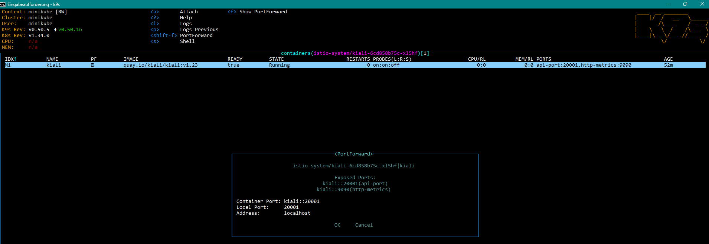
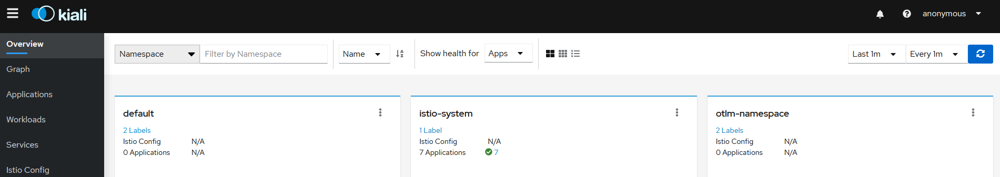
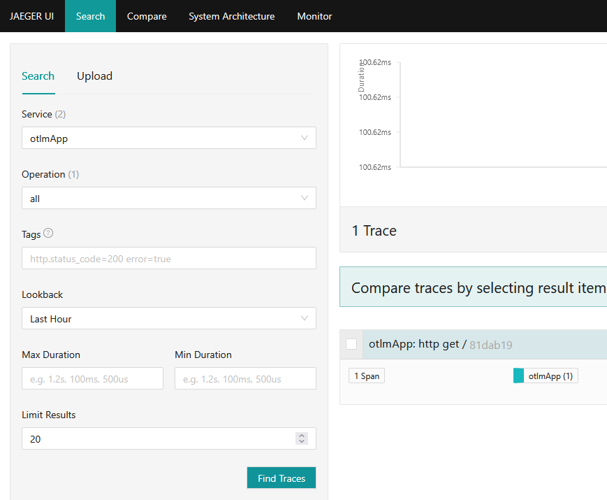

# otlm-app: Dummy project for Spring Boot for K8S cluster

## Project Overview

This is a sample Spring Boot application designed for deployment in Kubernetes clusters, with observability via
OpenTelemetry and integration with Elasticsearch. The project is written in Kotlin and uses Java 21.
In this project, I was using cutting edge versions of Spring Boot and Kotlin to explore new features and improvements at
the end of 2025.

## Requirements

- Java 21 (set via Gradle toolchain)
- Kotlin 2.2.21
- Gradle (wrapper included)
- Docker (for containerization)

## Main Plugins (see build.gradle.kts)

- org.springframework.boot: 4.0.0
- io.spring.dependency-management: 1.1.7
- kotlin("jvm"): 2.2.21
- kotlin("plugin.spring"): 2.2.21

## Key Dependencies

- Spring Boot Starters:
    - spring-boot-starter-data-jpa
    - spring-boot-starter-actuator
    - spring-boot-starter-opentelemetry
    - spring-boot-starter-data-elasticsearch
    - spring-boot-starter-elasticsearch
    - spring-boot-starter-webmvc
- Observability:
    - io.micrometer:micrometer-tracing-bridge-otel
    - io.opentelemetry:opentelemetry-exporter-otlp
- Serialization:
    - com.fasterxml.jackson.module:jackson-module-kotlin
- Kotlin:
    - org.jetbrains.kotlin:kotlin-reflect
- Testing:
    - spring-boot-starter-actuator-test
    - spring-boot-starter-opentelemetry-test
    - spring-boot-starter-webmvc-test
    - org.jetbrains.kotlin:kotlin-test-junit5
    - org.junit.platform:junit-platform-launcher

> For the full and up-to-date list, see [build.gradle.kts](build.gradle.kts).

---

## Build

Build the project using the Gradle wrapper:

```powershell
# from project root
./gradlew.bat clean build
```

The JAR will be generated in `build/libs/` as `otlmApp-0.0.1-SNAPSHOT.jar`.

---

## Run the app locally (without Docker)

You can run the Spring Boot app directly after building:

```powershell
# from project root
./gradlew bootRun
```

- App base URL: http://localhost:8082
- Health: http://localhost:8082/actuator/health
- Example endpoint (POST): http://localhost:8082/jobs

Note: The app is configured to listen on port `8082` (see `src/main/resources/application.yaml`).

---

## Run with Docker (single container)

Build an OCI image and run it with Docker:

```powershell
# from project root
docker build -t otlm-app:latest .
docker run --rm -p 8082:8082 --name otlm-app otlm-app:latest
```

> The Dockerfile exposes port 8082 and the app listens on 8082. Adjust if you change the app port.

---

## Run the full observability stack (Docker Compose)

The recommended local setup uses the OpenTelemetry Collector and Jaeger via Docker Compose.
This provides OTLP HTTP (`:4318`) and OTLP gRPC (`:4317`) endpoints for metrics, logs, and traces.

```powershell
# from project root
./gradlew clean build
docker compose up -d --build
```

Services:

- otel-collector: OTLP gRPC :4317, OTLP HTTP :4318, Health :13133, Prometheus :9464
- otlm-app: Spring Boot app :8082
- jaeger: Jaeger UI :16686, OTLP ingest for traces (enabled)

Access:

- App: http://localhost:8082
- App health: http://localhost:8082/actuator/health
- Jaeger UI (traces): http://localhost:16686

Environment variables (compose) used by the app:

- `MANAGEMENT_OTLP_METRICS_EXPORT_URL=http://otel-collector:4318/v1/metrics`
- `MANAGEMENT_TRACING_EXPORT_OTLP_ENDPOINT=http://otel-collector:4317`
- `MANAGEMENT_OTLP_LOGS_EXPORT_URL=http://otel-collector:4318/v1/logs`
- `OTEL_RESOURCE_ATTRIBUTES=service.name=otlm-app,service.namespace=testApp,service.version=0.0.1-SNAPSHOT`

---

## Viewing traces and metrics locally (without Minikube)

- Traces: Open Jaeger UI at http://localhost:16686
  - Select service: `otlm-app`
  - Generate traffic: send a request to the app, e.g.:
    ```powershell
    Invoke-RestMethod -Method POST -Uri http://localhost:8082/jobs -Body '{"job":"dev"}' -ContentType 'application/json'
    ```
    or from Postman or a browser.  

  - Refresh the Jaeger UI and inspect spans.

- Metrics: The app sends OTLP metrics to the Collector via OTLP HTTP (`/v1/metrics`).
  - In this setup, metrics are exported to the Collector's `debug`/logging exporter and visible in collector logs.
  - Optional: scrape the Collector's own Prometheus metrics at http://localhost:9464/metrics.
  - If you want to visualize app metrics, plug a backend like Prometheus+Grafana or an OTLP-capable metrics backend.

---

## Troubleshooting (local / Docker Compose)

If you see errors like:
- `Failed to publish metrics to OTLP receiver (context: url=http://localhost:4318/v1/metrics, ...)`
- `java.net.SocketException: Unexpected end of file from server`
- `Eine bestehende Verbindung wurde softwaregesteuert durch den Hostcomputer abgebrochen`

Checklist:

1. Use the hostname `otel-collector` from containers (not `localhost`). In Compose, the environment variables already point to `otel-collector`.
2. Collector healthy?
   ```powershell
   docker compose ps
   docker compose logs otel-collector | Select-String -Pattern error,failed
   ```
3. Connectivity from the app container:
   ```powershell
   docker compose exec otlm-app powershell -Command "curl -Method POST http://otel-collector:4318/v1/metrics -Body '{}' -ContentType 'application/json'"; if ($LASTEXITCODE -ne 0) { echo 'failed' }
   ```
4. Ports free / firewall not blocking (4317, 4318, 9464, 13133).
5. Ensure the Collector config has an OTLP receiver for both HTTP and gRPC and exports traces to Jaeger. See `otel-collector-config.yaml`.
6. For local runs (not in Docker), point the app to `http://localhost:4318` and ensure the Collector is running on the host.

---

## Tear Down

```powershell
docker compose down -v
```

---

## Minikube + Istio (optional)

```powershell
minikube start --memory=4096
```

Apply the Istio configuration:

```powershell
kubectl apply -f ./minikube/.
```

This will start the Istio components in your Minikube cluster and create a namespace `otlm-namespace` for the otlm-app.

Note:
- You can connect to the Minikube cluster using k9s or OpenLens.
- With OpenLens, wait until minikube is fully started. If there is a connection error, click on Disconnect and connect again so the correct port number is taken.

To access Kiali and other Istio tools:

Then navigate to http://localhost:20001/kiali/console in your browser


Jaeger UI:


---

### Reference Documentation

- [Official Gradle documentation](https://docs.gradle.org)
- [Spring Boot Gradle Plugin Reference Guide](https://docs.spring.io/spring-boot/4.0.0-SNAPSHOT/gradle-plugin)
- [Create an OCI image](https://docs.spring.io/spring-boot/4.0.0-SNAPSHOT/gradle-plugin/packaging-oci-image.html)
- [Spring Web](https://docs.spring.io/spring-boot/4.0.0-SNAPSHOT/reference/web/servlet.html)
- [Spring Boot Actuator](https://docs.spring.io/spring-boot/4.0.0-SNAPSHOT/reference/actuator/index.html)
- [OpenTelemetry](https://docs.spring.io/spring-boot/4.0.0-SNAPSHOT/reference/actuator/observability.html#actuator.observability.opentelemetry)

### Guides

- [Building a RESTful Web Service](https://spring.io/guides/gs/rest-service/)
- [Serving Web Content with Spring MVC](https://spring.io/guides/gs/serving-web-content/)
- [Building REST services with Spring](https://spring.io/guides/tutorials/rest/)
- [Building a RESTful Web Service with Spring Boot Actuator](https://spring.io/guides/gs/actuator-service/)

### Additional Links

- [Gradle Build Scans – insights for your project's build](https://scans.gradle.com#gradle)
